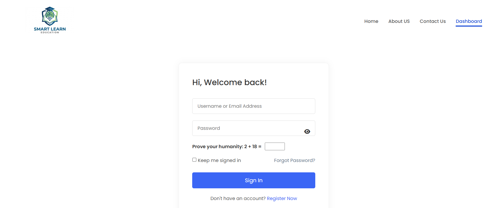
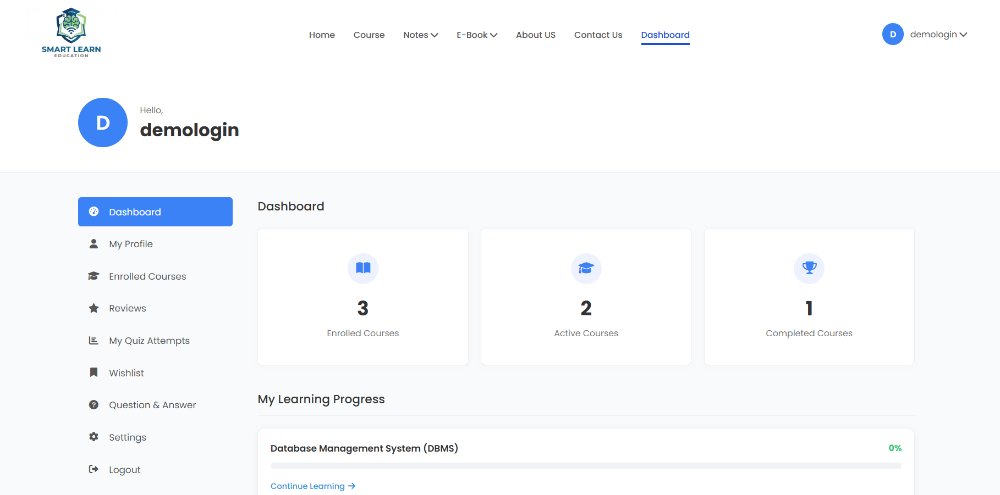
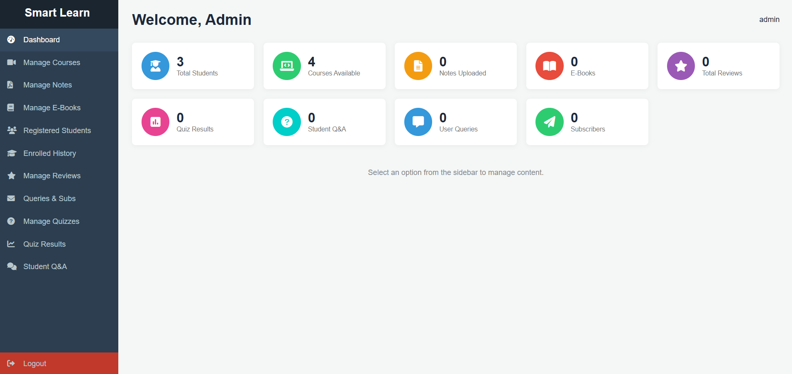

# Web-Based-E---Learning-Platform
Web-based e-learning platform built with PHP, MySQL, HTML, CSS, and JavaScript. Features include user registration/login, student dashboard for courses and quizzes, and an admin panel to manage content like lectures, notes, eBooks, and quizzes. Uses MySQL for efficient data storage.

Technologies Used: PHP, MySQL, HTML, CSS, JavaScript 
• Developed a web-based e-learning platform for students to access courses, notes, eBooks, and quizzes 
• Implemented basic user login and registration functionality using PHP and MySQL 
• Built admin panel to manage courses, lectures, notes, eBooks, and quizzes 
• Designed student dashboard for course access, quiz attempts, and progress tracking 
• Integrated MySQL database for efficient data storage and management


## How to Run the Project

### Prerequisites

* Install XAMPP or any local server (Apache + MySQL)
* Web browser (Chrome/Edge)

### Steps to Run

1. Download or clone the repository:

   ```
   git clone https://github.com/Rambhatt08/Web-Based-E---Learning-Platform.git
   ```

2. Move the project folder to:

   ```
   C:\xampp\htdocs\
   ```

3. Start XAMPP:

   * Start **Apache**
   * Start **MySQL**

4. Import Database:

   * Open **phpMyAdmin** (http://localhost/phpmyadmin)
   * Create a new database (e.g., `smartlearn`)
   * Import the file `smartlearn_db.sql`

5. Configure Database Connection:

   * Open `db_connect.php`
   * Set:

     ```
     $host = "localhost";
     $user = "root";
     $password = "";
     $database = "smartlearn_db";
     ```

6. Run the Project:

   * Open browser and go to:

     ```
     http://localhost/SmartLearn/
     ```

---

### Notes

* Videos are not included in the repository due to size limits.
* Uploaded content is stored in the `uploads` folder.


### Admin Registration

To register as an **Admin**, use the following secret key during registration:

```
Secret Key: Teacher2026
```

> Note: This key is required to enable admin privileges. Regular users do not need this key.


## Screenshots

### Home Page


### Login Page


### Student Dashboard Page


### Quiz Page


### Quiz Module Page


### Quiz Result Page
 

### Admin Dashboard Page

